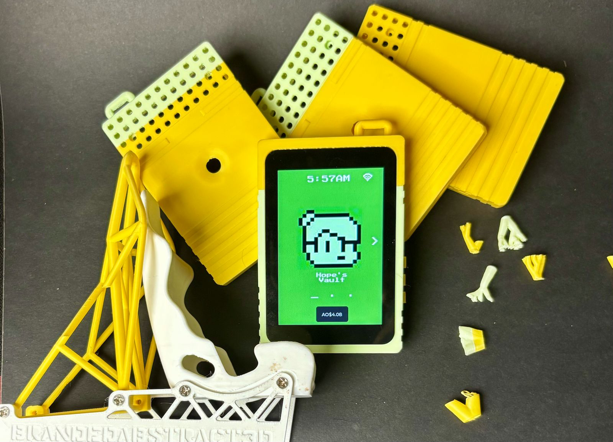
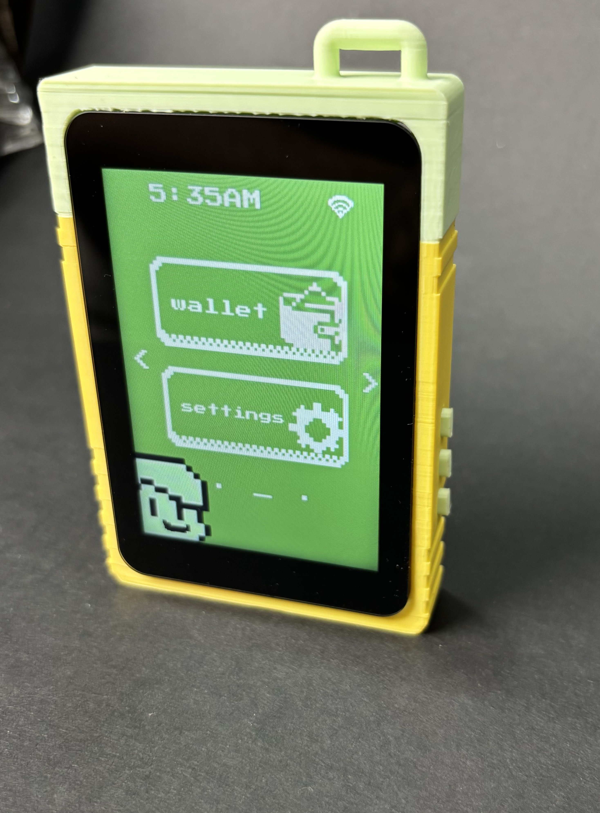
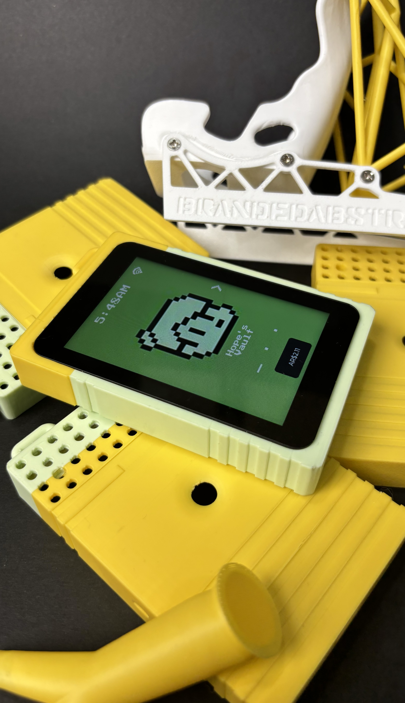
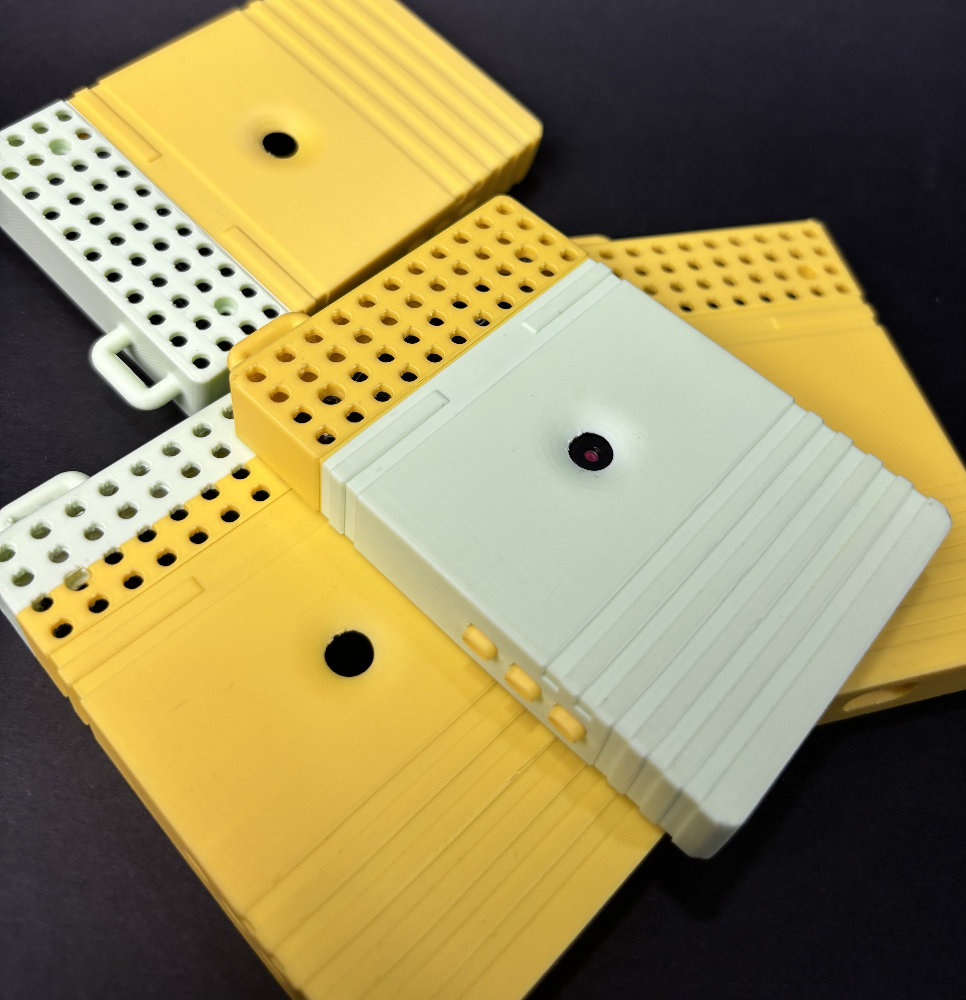

<p align="center">
  
</p>

<h1 align="center">Verifiable Wallet</h1>
<h3 align="center">Custom Hardware Wallet for the Arweave Permanent Web</h3>

<p align="center">
  
  
  
  
  
</p>

<br />

> **A dedicated hardware device that generates, stores, and signs Arweave transactions entirely on-device — your private key never touches the internet.**

---

## What is a Verifiable Wallet?

Most wallets are software running inside a browser or OS that you already trust to be secure. That trust is implicit — and fragile. A **verifiable wallet** changes the model:

- **Every cryptographic operation is performed on isolated hardware.** Key generation, signing, and decryption happen on a dedicated device with no network stack involved in the signing path.
- **The signing protocol is fully auditable.** Data item hashes travel to the device as QR codes; raw signatures travel back as QR codes. Every step is observable, loggable, and independently reproducible.
- **Deterministic key derivation means you can verify correctness.** The same 12-word BIP39 mnemonic always produces the exact same RSA 4096-bit key via a published, standard derivation path. Any third party can verify the key independently.
- **On-chain verifiability.** Signatures use RSA-PSS SHA-256 — the same algorithm Arweave gateways and the ANS-104 standard use for verification. Upload receipts can be cryptographically tied back to this wallet's public key by anyone.
- **No trusted intermediary.** The companion web app receives only a signature. It cannot access keys, cannot alter what was signed, and the resulting upload can be independently verified on-chain.

---

## Demo

<p align="center">
  
  &nbsp;&nbsp;
  
  &nbsp;&nbsp;
  
</p>

---

## How It Works

The device operates in two modes, switching between them via a hardware reboot coordinated by persistent storage:

```
┌─────────────────────────────────────────────────────────────────┐
│                    HARDWARE WALLET DEVICE                       │
│                                                                 │
│  ┌──────────────┐  reboot  ┌──────────────────────────────┐    │
│  │ WALLET MODE  │◄────────►│       SCANNER MODE           │    │
│  │              │          │                              │    │
│  │ • Manage keys│          │ • Camera active              │    │
│  │ • Show QRs   │          │ • Decodes hash QR from app   │    │
│  │ • Sign tx    │          │ • Saves hash to device       │    │
│  │ • Export JWK │          │ • Reboots to wallet mode     │    │
│  └──────────────┘          └──────────────────────────────┘    │
└─────────────────────────────────────────────────────────────────┘
```

### End-to-End Signing Flow

```
  WEB APP                                     HARDWARE DEVICE
     │                                              │
     │  1. App scans device's Full Public Key QR   │
     │◄─────────────────────────────────────────── │ [512-byte RSA owner, base64url]
     │                                              │
     │  2. App builds ANS-104 data item            │
     │     computes SHA-384 deep hash              │
     │     displays as Hash QR                     │
     │ ───────────────────────────────────────────►│ [{"v":1,"hash":"<base64url-48-bytes>"}]
     │                                              │
     │                                              │ 3. Device scans Hash QR (scanner mode)
     │                                              │    Saves hash to persistent storage
     │                                              │    Reboots to wallet mode
     │                                              │
     │                                              │ 4. User enters password
     │                                              │    Device decrypts JWK (AES-256-GCM)
     │                                              │    Signs: SHA256(hash) via RSA-PSS
     │                                              │    Displays Signature QR
     │                                              │
     │  5. App scans Signature QR                  │
     │◄─────────────────────────────────────────── │ [512-byte signature, base64url]
     │                                              │
     │  6. App uploads signed data item            │
     │     to Arweave via Turbo                    │
     │ ──► Arweave Permaweb ◄──────────────────────│ [verifiable on-chain]
```

---

## Cryptographic Stack

The wallet implements the full Arweave key derivation standard, end to end:

| Stage | Algorithm | Detail |
|---|---|---|
| Entropy | CSPRNG | 128 bits (16 bytes) of hardware randomness |
| Mnemonic | BIP39 | 12-word English wordlist, SHA-256 checksum |
| Seed derivation | PBKDF2-HMAC-SHA512 | Salt: `"mnemonic"`, 2048 iterations, 64-byte output |
| Key generation | RSA 4096-bit | Deterministic CTR-DRBG seeded from PBKDF2 output, exponent 65537 |
| Key format | JWK (RFC 7517) | Compatible with Wander, Arweave.app, and all Arweave tooling |
| Address | SHA-256(n) | base64url(SHA256(modulus)) → 43-character wallet address |
| Storage encryption | AES-256-GCM | PBKDF2-SHA256, 100,000 iterations, random salt + IV per write |
| Signing | RSA-PSS SHA-256 | 512-byte signature, ANS-104 compatible |

> The derivation path is fully documented in [`WALLET_RECIPE.md`](WALLET_RECIPE.md) and independently verifiable using [`jwk_to_address.py`](jwk_to_address.py).

---

## Features

- **On-device wallet generation** — BIP39 mnemonic created and displayed on hardware; mnemonic never transmitted
- **Deterministic & reproducible** — same 12 words always produce the same key; recovery is always possible
- **Air-gapped signing** — private key never leaves the device; only public key and signatures are shared
- **Password-protected storage** — JWK encrypted with AES-256-GCM before writing to SD card
- **QR-based protocol** — no manual data entry; all communication via camera and display
- **Two-mode architecture** — wallet mode for key management, scanner mode for hash capture
- **Arweave-native format** — JWK exportable to Wander, Arweave.app, and all ecosystem tools
- **Full public key QR** — 512-byte RSA owner for ANS-104 data item construction
- **Web companion app** — full React demo showing hardware-signed uploads via Turbo

---

## Wallet Menu

| Option | Description |
|---|---|
| **Public Key** | Shows the 43-character Arweave address as QR — use for receiving AR |
| **Full Public Key** | Shows the 512-byte RSA owner as QR — required for the upload signing flow |
| **Sign tx** | Signs a pending data-item hash; triggers scanner mode if no hash is queued |
| **Export key** | Exports the decrypted JWK (password required) for use in other wallets |
| **Delete wallet** | Permanently removes wallet data from SD card |

---

## Getting Started

### Hardware Requirements

| Component | Specification |
|---|---|
| **Microcontroller** | ESP32-S3 (dual-core, 8 MB PSRAM, 16 MB flash) |
| **Display** | 3.5" ST7796 LCD, 320×480, capacitive touch (FT6336) |
| **Camera** | OV3660 or OV5640 (for scanner mode / QR decoding) |
| **Storage** | MicroSD card (FAT32, for encrypted JWK and wallet data) |
| **Tested Board** | ESP32-S3-Touch-LCD-3.5 (Waveshare) |

> Pinout is defined in `include/board_pins.h` and `components/esp_port/`. Porting to another ESP32-S3 board requires updating pin definitions and potentially display/touch drivers.

### Software Prerequisites

- [ESP-IDF v5.1+](https://docs.espressif.com/projects/esp-idf/en/latest/esp32s3/get-started/)
- Python 3 (for IDF tooling)
- Node.js 18+ (for the web companion app only)

### Build & Flash

```bash
# Clone the repository
git clone https://github.com/YOUR_USERNAME/verifiable_wallet
cd verifiable_wallet

# Set target and build
idf.py set-target esp32s3
idf.py build

# Flash and open serial monitor
idf.py -p /dev/cu.usbserial-XXXX flash monitor
```

> Replace `/dev/cu.usbserial-XXXX` with your board's port (e.g. `COM3` on Windows).

### Web Companion App

```bash
cd uploading_app_demo/uploading_app_demo
npm install
npm run dev
```

Open `http://localhost:5173` to run the full hardware-signed upload demo.

---

## First-Time Setup

1. Insert a **formatted SD card** and power on the device
2. From the home screen, select **Wallet → Create Wallet**
3. The device generates 128 bits of entropy, derives the BIP39 mnemonic, and displays the 12 words
4. **Write down your mnemonic — this is your backup**
5. Set a **password** to encrypt the key on SD
6. Wallet data is saved under `/sdcard/wallet/` (encrypted JWK, address, public key)

---

## Repository Structure

```
verifiable_wallet/
├── src/
│   ├── main.cpp                  # Entry point: hardware init, boot mode, Wi-Fi, LVGL
│   ├── wallet/                   # LVGL UI screens (menu, QR display, password, sign flow)
│   ├── arweave_wallet_gen.c      # BIP39 → PBKDF2 → RSA 4096 key generation
│   ├── wallet_encrypt.c          # AES-256-GCM JWK encryption / decryption
│   ├── wallet_sd.c               # SD card read/write for wallet data
│   ├── wallet_sign.c             # RSA-PSS SHA-256 signing
│   └── boot_mode.c               # NVS boot mode + pending hash management
├── components/esp_port/          # Hardware drivers: LCD, touch, SD, camera
├── include/board_pins.h          # Pin definitions for the target board
├── uploading_app_demo/           # React web app: build hash QR, scan signature, upload
├── WALLET_RECIPE.md              # Full cryptographic derivation specification
├── HARDWARE_PROTOCOL.md          # QR payload format spec (device ↔ web app)
├── LEARNING.md                   # Implementation notes and hard-won lessons
└── jwk_to_address.py             # Utility: verify JWK produces expected Arweave address
```

---

## Security Model

| Property | Detail |
|---|---|
| **Private key isolation** | Private key generated and decrypted only on-device; never transmitted |
| **Encrypted at rest** | JWK stored on SD with AES-256-GCM; requires password to decrypt |
| **Air-gapped signing path** | Signing uses QR codes only; no network connection required |
| **Mnemonic portability** | Standard BIP39; wallet recoverable in Wander or any compatible tool |
| **Signature binding** | RSA-PSS signature is bound to the exact hash shown by the app; cannot be reused for a different payload |
| **Public-only sharing** | The 512-byte owner and 43-byte address are public; the signature QR is safe to share after you intend to complete the upload |

> **Backup your 12-word mnemonic and password.** They are the only way to recover a wallet if the device or SD card is lost or damaged.

---

## QR Protocol Reference

The device and web app communicate exclusively via QR codes. Full specification in [`HARDWARE_PROTOCOL.md`](uploading_app_demo/uploading_app_demo/HARDWARE_PROTOCOL.md).

| Step | Direction | Payload |
|---|---|---|
| Public Key | Device → App | Base64url-encoded 512-byte RSA owner (not the 43-char address) |
| Hash | App → Device | `{"v":1,"hash":"<base64url-48-byte SHA-384 deep hash>"}` |
| Signature | Device → App | Base64url-encoded 512-byte RSA-PSS signature |

---

## Adapting to Other Hardware

1. **Pins** — Update `include/board_pins.h` and `components/esp_port/` for your LCD, touch, SD, and camera wiring
2. **Display driver** — Replace `esp_3inch5_lcd_port` if your display uses a different controller; update resolution in `main.cpp`
3. **PSRAM / Flash** — `sdkconfig.defaults` targets 8 MB PSRAM and 16 MB flash; reduce LVGL or camera buffers if your board has less
4. **No camera** — Scanner mode requires a camera; wallet mode (key management, signing a pre-saved hash) works without one

---

## References

- [BIP39 — Mnemonic Code for Deterministic Keys](https://github.com/bitcoin/bips/blob/master/bip-0039.mediawiki)
- [ANS-104 — Arweave Bundled Data Standard](https://github.com/ArweaveTeam/arweave-standards/blob/master/ans/ANS-104.md)
- [RFC 7517 — JSON Web Key (JWK)](https://www.rfc-editor.org/rfc/rfc7517)
- [Arweave Cookbook — Wallets and Keys](https://cookbook.arweave.dev/fundamentals/wallets-and-keyfiles/)
- [ArDrive Turbo SDK](https://github.com/ardriveapp/turbo-sdk)
- [ESP-IDF Documentation](https://docs.espressif.com/projects/esp-idf/en/latest/esp32s3/)

---

<p align="center">
  Built with mbedTLS · LVGL · ESP-IDF · React · Arweave
</p>
